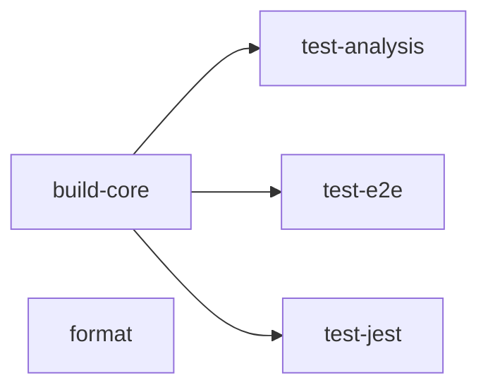
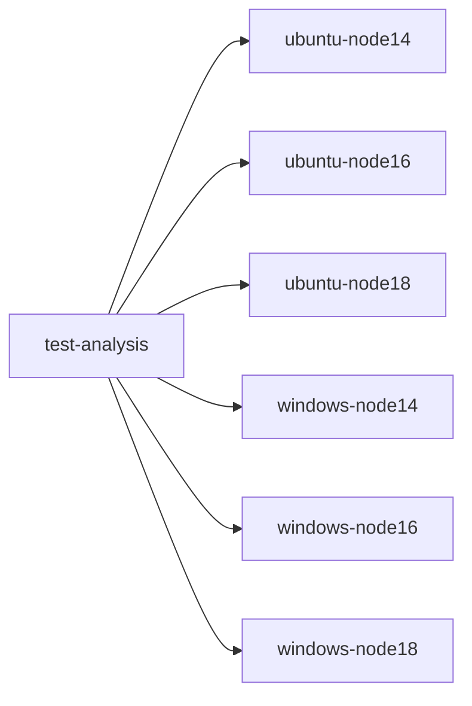

# Stencil Continuous Integration (CI)

Continuous integration (CI) is an important aspect of any project, and is used to verify and validate the changes to the
codebase work as intended, to avoid introducing regressions (bugs), and to adhere to coding standards (e.g. formatting
rules). It provides a consistent means of performing a series of checks over the entire codebase on behalf of the team.

This document explains Stencil's CI setup. 

## CI Environment

Stencil's CI system runs on GitHub Actions.
GitHub Actions allow developers to declare a series of _workflows_ to run following an _event_ in the repository, or on
a set schedule.

The workflows that are run as a part of Stencil's CI process are declared as YAML files, and are stored in the same
directory as this file.
Each workflow file is explained in greater depth in the [workflows section](#workflows) of this document.

## Workflows

This section describes each of Stencil's GitHub Actions workflows.
Generally speaking, workflows are designed to be declarative in nature.
This section does not intend to duplicate the details of each workflow, but rather give a high level overview of each
one and mention nuances of each.

### Main (`main.yml`)

The main workflow for Stencil can be found in `main.yml` in this directory.
It is responsible for:
- Building Stencil (and Validating the Build)
- Running Unit, E2E, etc. Tests against the Build
- Verifying that the Codebase is Properly Formatted

Each of these tasks are codified as _jobs_, and are listed in `main.yml`.
Most of the jobs above are contingent on the 'build step' finishing (otherwise there would be nothing to test).
The diagram below displays the dependencies between each job.

Each of the jobs in this workflow are _composite actions_.
This allows CI to run more jobs in parallel, improving the throughput of a single workflow run.
All composite actions can be found in the [actions directory](./actions).
Each action is defined in an `action.yml` file defined in a subdirectory that matches its name.
This is a GitHub Actions convention.

#### Running Tests

All test-related jobs require the build to finish first.
Upon successful completion of the build job, each test job may start.

The test jobs have been designed to run in parallel and may run against several operating systems & versions of node.
For a test job that theoretically runs on Ubuntu and Windows operating systems and targets Node v14, v16 and v18, a
single test job may spawn several jobs:

These 'os-node jobs' (e.g. `ubuntu-node16`) are designed to _not_ prematurely stop their sibling jobs should one of
them fail.
This allows the opportunity for the sibling tests to potentially pass, and reduce the number of runners that need to
be spun up again should a developer wish to 're-run failed jobs'.
Should a developer feel that it is more appropriate to re-run all os-node jobs, they may do so using GitHub's 're-run
all jobs' options in the GitHub Actions UI.

#### Coding Standards Checks

Verifying the format of the code is properly formatted is not reliant on any other job.
It may run in parallel with the build job.
This is beneficial in that it allows the workflow to 'fail-fast' for an easily fixable CI failure (as opposed to
waiting for CI to pass every other step, only to find the formatter to fail the workflow at the very end).

#### Concurrency

When a `git push` is made to a branch, workflow is designed to stop existing job(s) associated with the workflow + 
branch.
A new workflow run will begin upon stopping the existing job(s) using the new `HEAD` of the branch.

### BrowserStack (`browserstack.yml`)

This workflow is used to run a series of integration tests using [BrowserStack](https://www.browserstack.com).
The exact details of which browsers are targeted can be found in the [karma directory](../../test/karma) of the project.

Running this workflow requires a username + access key in order to access BrowserStack.
These credentials are stored as secrets in GitHub.

This workflow differs from most in that it is designed to run on `pull_request_target` triggers.
This allows community provided pull requests to run BrowserStack tests. 

## Repository Configuration

Each of the workflows described in the [workflows section](#workflows) of this document must be configured in the
Stencil GitHub repository to be _required_ to pass in order to land code in the `main` branch.
