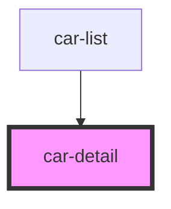

# car-detail

<!-- Auto Generated Below -->

## Properties

| Property | Attribute | Description | Type      | Default     |
| -------- | --------- | ----------- | --------- | ----------- |
| `car`    | --        |             | `CarData` | `undefined` |

## Dependencies

### Used by

 - [car-list](../car-list)

### Graph

----------------------------------------------

*Built with [StencilJS](https://stenciljs.com/)*
