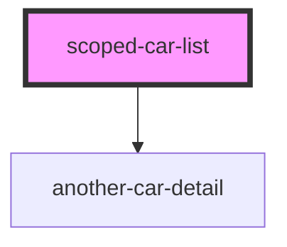

# cmp-server-vs-client

<!-- Auto Generated Below -->

## Overview

Component that helps display a list of cars

## Properties

| Property   | Attribute | Description | Type        | Default     |
| ---------- | --------- | ----------- | ----------- | ----------- |
| `cars`     | --        |             | `CarData[]` | `undefined` |
| `selected` | --        |             | `CarData`   | `undefined` |

## Events

| Event         | Description | Type                   |
| ------------- | ----------- | ---------------------- |
| `carSelected` |             | `CustomEvent<CarData>` |

## Slots

| Slot       | Description                      |
| ---------- | -------------------------------- |
| `"header"` | The slot for the header content. |

## Shadow Parts

| Part    | Description                                 |
| ------- | ------------------------------------------- |
| `"car"` | The shadow part to target to style the car. |

## Dependencies

### Depends on

- [another-car-detail](.)

### Graph

----------------------------------------------

*Built with [StencilJS](https://stenciljs.com/)*
