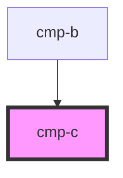

# cmp-c

<!-- Auto Generated Below -->

## Dependencies

### Used by

 - [cmp-b](.)

### Graph

```mermaid
graph TD;
  cmp-b --> cmp-c
  style cmp-c fill:#f9f,stroke:#333,stroke-width:4px
```

----------------------------------------------

*Built with [StencilJS](https://stenciljs.com/)*
