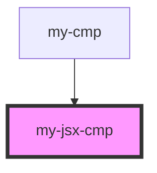

# hydrate-props

<!-- Auto Generated Below -->

## Properties

| Property  | Attribute  | Description | Type     | Default     |
| --------- | ---------- | ----------- | -------- | ----------- |
| `barProp` | `bar-prop` | bar prop    | `string` | `'bar'`     |
| `fooProp` | `foo-prop` | foo prop    | `string` | `undefined` |
| `mode`    | `mode`     | Mode        | `any`    | `undefined` |

## Dependencies

### Used by

 - [my-cmp](.)

### Graph

----------------------------------------------

*Built with [StencilJS](https://stenciljs.com/)*
