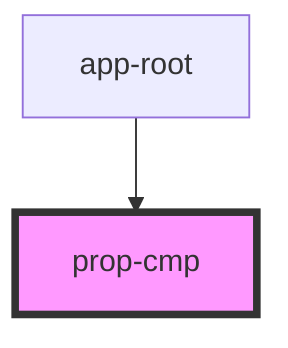

# prop-cmp

<!-- Auto Generated Below -->

## Properties

| Property   | Attribute   | Description   | Type     | Default             |
| ---------- | ----------- | ------------- | -------- | ------------------- |
| `clothes`  | `clothes`   |               | `string` | `'life preservers'` |
| `first`    | `first`     |               | `string` | `undefined`         |
| `fullName` | `full-name` |  _(readonly)_ | `string` | `undefined`         |
| `lastName` | `last-name` |               | `string` | `undefined`         |
| `mode`     | `mode`      | Mode          | `any`    | `undefined`         |

## Dependencies

### Used by

 - [app-root](../app-root)

### Graph

----------------------------------------------

*Built with [StencilJS](https://stenciljs.com/)*
